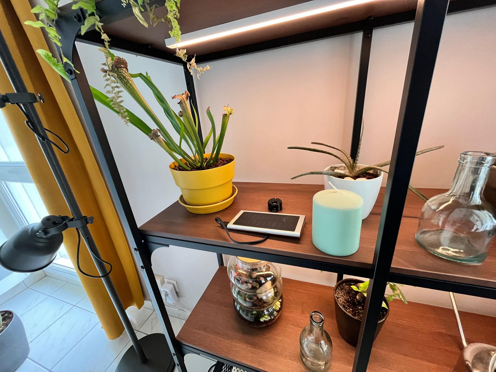
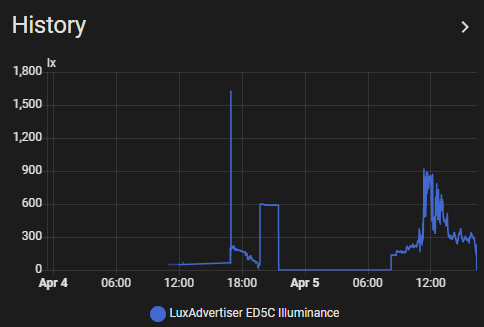
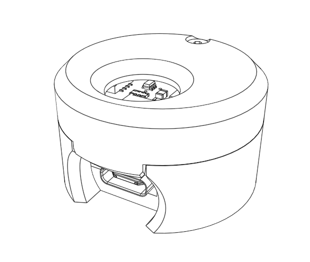
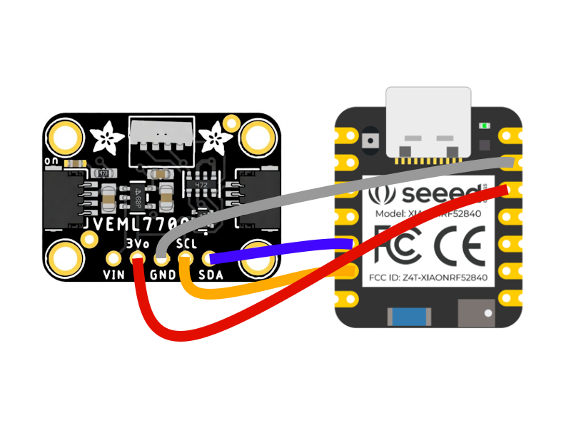

# LuxAdvertiser

[](./LICENSE)
[](https://opensource.org/)
[](https://www.oshwa.org/definition/)

🌱 A small DIY BLE lux sensor for Home Assistant using BTHome, built around the Seeed Studio XIAO nRF52840.

## ✨ Why This Project?

This project measures ambient light with a VEML7700 and advertises the lux value over BLE using BTHome.

It is designed to be simple and practical:
- 🔌 USB-powered (or external USB battery pack)
- 🧠 No battery management complexity
- 🏡 Perfect for long-term indoor plant monitoring

### 🌱 Gardening Use Case

Put it near a plant spot, collect lux history, and verify if that location is actually good for your plant. The goal is a tiny sensor you can place and use remotely on Home Assistant's dashboard.

  

## 🚀 Features

- **Lux Measurement**: VEML7700 ambient light readings.
- **BTHome Protocol**: Native-friendly with Home Assistant BLE integration.
- **Simple Power Model**: USB only, no onboard battery monitoring.
- **Boot LED Feedback**: Quick color flashes show system status.

## 🧰 Hardware Requirements

- Seeed Studio XIAO nRF52840
- VEML7700 Ambient Light Sensor
- USB-C power source or external USB battery pack
- Wires

## 📦 BOM

- 1x M2x10 screw
- 1x M2 heat insert
- 1x 3D printed enclosure (see below)
- 1x Seeed Studio XIAO nRF52840
- 1x VEML7700 Ambient Light Sensor
- Wires for I2C and power connections

## 🖨️ 3D Enclosure

The enclosure was designed in OnShape and is intended to be 3D printed.



[OnShape Model](https://cad.onshape.com/documents/a6520b5bcc45139a07dec6a0/w/8785962cd5c47eca463f3edf/e/562fdbec90560b909e2e8cf4?renderMode=3&uiState=69d23bb86be0f977970a4154) 


## 📌 Pinout

### Seeed Studio XIAO nRF52840 and VEML7700 Connections

| XIAO BLE Pin | Function | VEML7700 Pin |
|-----|----------|--------------|
| 3V3 | Power Output |  VCC |
| GND | Ground | GND |
| D4 (P0.04) | I2C SDA | SDA |
| D5 (P0.05) | I2C SCL | SCL |
| LED_BUILTIN (P0.26) | Status Indicator | - |




## 💻 Software Setup

### Prerequisites

- PlatformIO
- Arduino IDE or VS Code with PlatformIO extension
- Home Assistant with BLE integration enabled

### Installation

1. Clone this repository:
  ```bash
  git clone https://github.com/FLo-ABB/LuxAdvertiser.git
  cd LuxAdvertiser
  ```
2. Open the project in PlatformIO / VS Code.
3. Build and upload:
  ```bash
  platformio run --target upload
  ```
4. Connect the hardware as described in the pinout section.

### Home Assistant Integration

1. Enable BLE integration in Home Assistant.
2. Power on the device. It should appear as **LuxAdvertiser**.
3. Add the BTHome device. The lux sensor should be auto-discovered.

## ▶️ Usage

- On power-up, the device runs a boot sequence:
  - **Blue flash (once)**: BLE setup succeeded.
  - **Green flash (once, after blue)**: Lux sensor setup succeeded.
  - **Red flash (once)**: BLE or sensor setup failed for that attempt.
- If BLE or sensor setup fails, initialization retries every 10 seconds.
- BLE advertising starts only when **both** BLE and sensor are ready.
- Once fully initialized, the status LED is off during normal operation (saving power).

## 🧯 Troubleshooting

If it acts weird, no panic, follow this flow.

1. **Power and wiring check**
  - Confirm the board is powered over USB.
  - Confirm VEML7700 wiring: VCC->3V3, GND->GND, SDA->D4, SCL->D5.
2. **Observe LED sequence after power-on**
  - Blue once + green once: startup successful.
  - Red once: last startup step failed.
  - Red every 10s: repeated startup failure (BLE or sensor).
3. **Verify BLE visibility**
  - Scan with nRF Connect first.
  - If visible in nRF Connect but not Home Assistant, check HA BLE integration/range.
4. **Validate sensor readiness**
  - If there is no green flash, focus on I2C wiring and sensor power.
  - Advertising is intentionally blocked until sensor initialization succeeds.
5. **Check runtime behavior**
  - Advertising updates every 30s by design.

## 🤝 Contributing

Pull requests are welcome. Hobby project spirit: keep it simple, test on real hardware, and share what you learn.

## 📄 License

Released under the MIT License. See [LICENSE](./LICENSE).

## 🧡 Open Source and Open Hardware Notes

- This repository (firmware, documentation, enclosure model) is published as an open-source hobby project under MIT.
- Hardware modules used here are off-the-shelf components from their respective vendors.
- Check vendor pages for component-specific hardware design files and licensing details.

## 🙏 Acknowledgments

- BTHome protocol: https://bthome.io/
- BTHome format and examples: https://bthome.io/format/
- Home Assistant Bluetooth integration docs: https://www.home-assistant.io/integrations/bluetooth/
- Home Assistant BTHome integration docs: https://www.home-assistant.io/integrations/bthome/
- Seeed Studio XIAO nRF52840 documentation: https://wiki.seeedstudio.com/XIAO_BLE/
- Adafruit VEML7700 sensor guide: https://learn.adafruit.com/adafruit-veml7700
- ArduinoBLE library reference: https://www.arduino.cc/reference/en/libraries/arduinoble/
- Adafruit VEML7700 Arduino library: https://github.com/adafruit/Adafruit_VEML7700